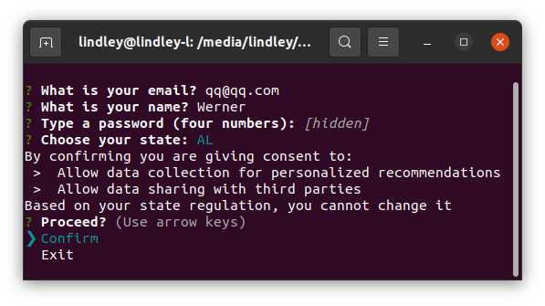

# Data-Privacy-Consent-Manager
A simple command-line tool using Node.js that simulates a data privacy consent manager.
The tool should allow users to manage their data privacy preferences by giving or revoking consent for different types of data processing.

## Images
These are images from the tool

#### Project overview

#### Welcome screen

#### Login screen

#### Main screen

#### Editing preferences

#### Confirm revoke message

#### Create Account screen

#### Confirm preferences message

